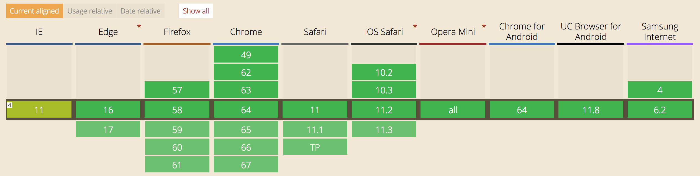

# Flex 布局介绍

css传统的解决方案基于盒子模型，依赖于`display`、`position`、`float`属性，它对于那些特殊布局非常不方便，比如单单 *垂直居中* 就不容易实现。

flex布局是W3C再2009年提出的一种新的布局方案，可以简便、完整、响应式地实现各种页面布局。目前其浏览器支持情况如下：

其中，IE浏览器到目前为止还只是部分支持，所以在一些需要对ie提供支持的场景无非使用。
## 指定Flex布局
任何容器和行内元素都可以使用Flex布局
```css
.box {  
    display:flex;
}

.box-inline {
    display:inline-flex;
}
```
## 基本概念
* 采用Flex布局的元素，称为Flex容器(flex container)
* 其子元素自动成为容器成员，称为Flex项目，flex-item

容器默认存在两根轴
* 水平的主轴，main axios；主轴开始的地方叫main start，结束的位置叫main end；
* 垂直的交叉轴，cross axis； 交叉轴开始的位置叫cross start。结束的位置叫做cross end；

## Flex Container的属性
### flex-direction

```css
.box {
    flex-direction:row | row-reverse | column | column-reverse
}
```

### flex-wrap

```css
.box {
    flex-wrap: nowrap | wrap | wrap-reverse;
}
```
-  wrap 换行，第一行在上方
- wrap-reverse: 换行，第一行在下方

### flex-flow
`flex-flow` 属性是`flex-direction`、`flex-wrap`属性的简写形式，默认值是 `row nowrap`。
```css
.box {
    flex-box: <flex-direction> || <flex-wrap>
}
```

### justify-content
`justify-content`定义了项目在主轴上的对齐方式

可以取5个值
* flex-start
* flex-end
* center
* space-between 两端对齐，项目之间的间隔都相等。
* space-around 每个项目两侧的间隔都相等。

### align-items
`align-items`定义了item在交叉轴上的如何对齐。
可以取5个值：
* flex-start 交叉轴的起点对齐
* flex-end 交叉轴的重点对齐
* center 交叉轴的中点对齐
* baseline 项目的第一行文字的基线对齐
* stretch [默认值]，如果项目未设置高度或者设为auto，将占满整个容器高度。

### align-content
`align-content`属性定义了多根轴线的对齐方式。
**如果仅仅存在一个轴线，该属性不起作用。**
```css
.box {
    align-content: flex-start | flex-end | center | space-between | space-around | stretch;
}
```
该属性可以取6个值：
* flex-start: 与交叉轴的起点对齐；
* flex-end: 与交叉轴的终点对齐；
* center: 与交叉轴的中点对齐；
* space-between: 与交叉轴两端对齐，轴线之间的间隔平均分布；
* space-around: 每根轴线两侧的间隔都相等；
* stretch: [默认值], 轴线占满整个交叉轴。

## Flex Item 属性

#### order 属性
`order`属性定义项目的排列顺序。数值越小，排列越靠前，默认是0.

#### flex-grow 属性
`flex-grow`属性定义项目的放大比例，默认是`0`. `0`代表即使不存在剩余空间，也不放大。
所有的item定义的值若非0相等，则平分所有空间。

#### flex-shrink 属性
`flex-shrink`属性定义了项目的缩小比例，默认是1，即如果空间不足，该项目将缩小。
若一个项目的`flex-shrink`属性为`0`，其他项目都是`1`，则空间不足时，前者不缩小。

#### flex-basis 属性
`flex-basis`定义了`item`在主轴方向上的初始大小，可以设置长度值，也可以设置为`auto`、`content`。
`flex-basis`当设置为`auto`，而`width`设置有长度值的时候，`flex-basis`则会`width`值。
同时设置`flex-basis`和`width`值时候，则会以`flex-basis`为准。

#### flex属性
`flex`属性是`flex-grow`、`flex-shrink`和`flex-basis`的简写，默认值是`0 1 auto`, 后两个属性可选。

该属性有两个快捷键：

* flex:auto 代表 flex:1 1 auto
* flex:none 代表 flex:0 0 auto

#### align-self 属性
`align-self` 属性用于 item 覆写 container 的 `align-items` 属性。`align-self` 允许某个 item 有着不一样的对齐方式。

其属性值与 `align-items` 一致。

> 参考 阮一峰 博客
> http://www.ruanyifeng.com/blog/2015/07/flex-grammar.html?^%$